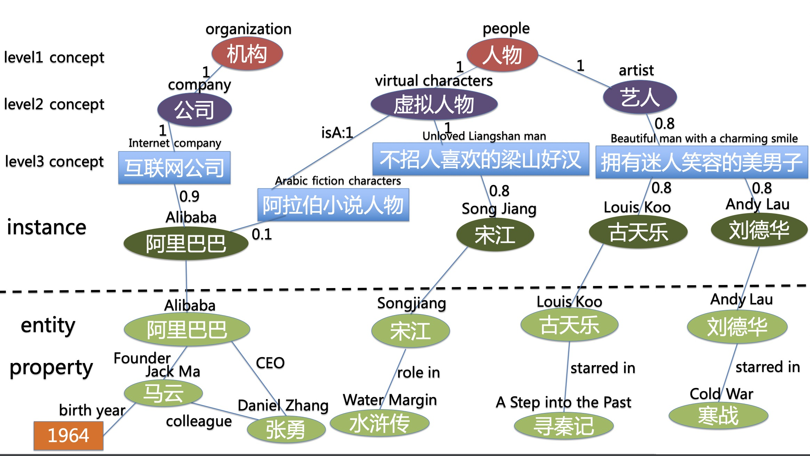
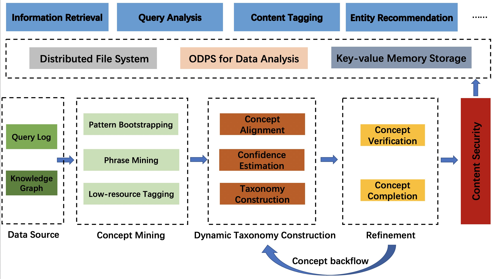
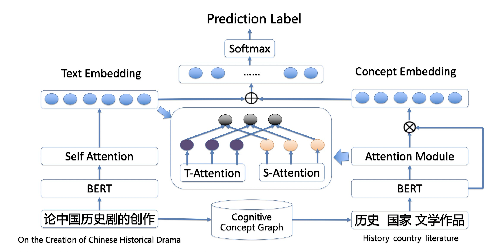

## Alibaba Cognitive Concept Graph (AliCG)

[](https://github.com/alibaba-research/CognitiveConceptGraph/blob/master/LICENSE)
[](https://github.com/alibaba-research/CognitiveConceptGraph/stargazers)
[](https://github.com/alibaba-research/CognitiveConceptGraph/network/members)
[](http://hits.dwyl.io/zxlzr/https://githubcom/alibaba-research/CognitiveConceptGraph)

## Abstract 

Conceptualization helps humans generalize previously gained knowledge and experience to new settings. This may reveal paths to high-level cognitive System 2 in a conscious manner. Extensive previous research had demonstrated that it is beneficial for search engines to mine concept knowledge from text.  However, we argue that most prior approaches extract formal high-frequency concepts from Wikipedia. Thus, these concepts are coarse-grained and static. In this paper, we introduce an approach of implementing and deploying Alibaba Cognitive Concept Graph in Alibaba UC Browser. Alibaba Cognitive Concept Graph is a system that can extract fine-grained, dynamic, and high-quality concepts by mining a large number of search logs and web data. The extracted concepts are fine-grained and not treated as black and white. This implies that the concepts have probabilities that are updated in real-time through user behaviors.  We further present techniques for automatically verifying and completing the cognitive concept graph. The cognitive concept graph helps improve search and entity recommendations in Alibaba UC  Browser. Extensive offline evaluation experiments demonstrate that our approach can extract higher quality concepts compared with baselines. We deploy the system in Alibaba UC Browser. Online A/B testing results show that the impression efficiency of the relevant score increases by 12%, the click-through rate increased by 5.1%, and the page view increases by 5.5%.  

## Motivation

 
A large number of previous studies have investigated the extraction of knowledge and the development of taxonomies. Approaches such as  YAGO  and DBPedia utilize Wikipedia categories.  Probase proposes an approach for extracting concepts from free text in web documents.  However, we argue that these approaches have limitations in extracting concepts from the noisy and unformal text, and thus, they cannot conceptualize fine-grained instances in the real world.  ConcepT proposed an approach to discover user-centered concepts at the right granularity conforming to user interests. However, it is difficult to acquire long-tail or nonentity instances and concepts. For example,  conventional approaches cannot retrieve the concept of instances such as “postpartum confinement”  and “cough.”   However, it is beneficial if we can infer that a search user is interested in  "conventional practice following childbirth" or "symptom of pneumonia." Moreover, mined concepts are treated as black and white. This has evident limitations because the concept of space is extensive, and different types of knowledge have different confidence intervals or probabilities. For example, we can tag the query "Drawing Sword fifth episode (亮剑 第五集)" with multiple concepts such as "TV series starring Li Youbin in 2015 (2005年李幼斌主演电视剧)" or "TV series starring Huang Zhizhong in 2011 (2011年黄志忠主演电视剧)." However, "TV series starring Huang Zhizhong in 2015" is a recent well-known TV series, which implies high probability. Such prior knowledge is beneficial for user intent detection because user search queries are typically short and lack essential context.  In addition,  previous approaches do not automatically verify and complete cognitive concept graphs. As a result, parts of links in cognitive concept graphs are wrong or missing, and this reduces performance when applying the cognitive concept graph to applications. A machine's ability to conceptualize and extract fine-grained and dynamic concept knowledge is critical for improving the intelligence of search engines. To this end, we propose the Alibaba Cognitive Concept Graph (AliCG), which is a large-scale concept mining system at Alibaba that aims to discover and update concepts automatically. Different from prior work, AliCG can mine concepts with dynamic probabilities in real-time.  We introduce our design of AliCG and our experience of deploying it in Alibaba UC Browser, which has the largest market share in the Chinese mobile browser market, with more than 300 billion daily active users. 
## What is Alibaba Cognitive Concept Graph

AliCG can significantly boost the performance of search engine results via the taxonomy dynamic constructed from mined fine-grained concepts and a novel learning algorithm that learns context-aware knowledge-enhanced representation. AliCG contains a large number of conceptual examples (including entities such as "Andy Lau" and nonentities such as "postpartum confinement"), various granular concepts (such as "actor," "pink boy in the circle"), the generic relationships between entities and concepts (such as "Andy Lau isA actor"), and the subclasses of the relationships between concepts and concepts (such as "movie actor" is a subclass of "actor"). Typically, these relations are referred to as isA relationships.  AliCG comprises the following four levels: 

**Level1**: The cognitive domain node, which expresses the domain to which the underlying node belongs.

**Level2**: The specific cognitive concept, expressing the abstract concept of the underlying node

**Level3**: The concept of fine-grained user cognition, the most important node  to express user fine-grained cognition

**Instance layer**: an instance of a concept, such as a conceptual mention phrase 

 

## Related Works 

There are several related works and we display them in the table bellow:

| Knowledge Graph    | Feature| Source| Refinement|
|  ----  | ----  |----| ----  |
| YAGO | Static |Text|No|
| Dbpedia | Static |Text|No|
| Microsoft Concept Graph | Static |Text|No|
| Tencent ConcepT | Static |Text|Yes|
| Alibaba Cognitive Concept Graph | Dynamic  |Text&KG|Yes|

## How do we construct? 

We leverage both raw text and knowledge graph to construct a cognitive concept graph. We also propose a novel refine the algorithm to make cognitive concept graph completion and concept verification automatically.  

 
 

## How to use?

The data structure of congitnve concept is show bellow(separeted by \t):

```
盲探    {"kg_info": [{"hot": "367", "guid": "bd77432e-4654-11e5-8ba6-f80f41fb03aa"}], "concepts": [{"concept": "影视", "score": 1.0, "level": 1}, {"isA": "影视", "concept": "电影", "score": 1.0, "level": 2}, {"concept": "影视节目", "score": 0.91, "level": 3}, {"concept": "好看的搞笑电影", "score": 0.03, "level": 3}, {"concept": "犯罪悬疑的影视作品", "score": 0.01, "level": 3}, {"concept": "杜琪峰高人气作品", "score": 0.01, "level": 3}, {"concept": "经典的搞笑电影", "score": 0.01, "level": 3}, {"concept": "杜琪峰影视作品", "score": 0.01, "level": 3}, {"concept": "刘德华经典电影", "score": 0.01, "level": 3}, {"concept": "第33届香港金像奖入围影片", "score": 0.0, "level": 3}, {"concept": "同为杜琪峰导演高人气电影", "score": 0.0, "level": 3}, {"concept": "心理犯罪的影视作品", "score": 0.0, "level": 3}, {"concept": "郑秀文刘德华电影", "score": 0.0, "level": 3}, {"concept": "刘德华与郑秀文电影", "score": 0.0, "level": 3}]}
```


### 1. Concept Embedding 

It is also possible to train concept embedding with random work or  node2vec.  You can leverage those pretrained concept embedding for downstream tasks.

### 2. Conceptualized Pretraining and Finetuning 
It is helpful to leverage conceptualize leaning as the figure shows. Those leaned contextualized concept embedding the right part of the figure will benefit downstream tasks a lot. 
 
## Applications 

### Pretraining with Cognitive Concept Graph

There are lots of approaches that leverage knowledge for language pretraining, such see ERINE-baidu[1] and ERINE-tsinghua[2]. 

### Fintuneing downstream tasks

It is convenient to leverage concept knowledge directly via feature concatenation for downstream tasks such as intent classification, natural language Inference, question answering, named entity recognition. 


## Acknowledgment 

We also pay high respect to the "predecessors" of the concept graph include [Yago](https://www.mpi-inf.mpg.de/departments/databases-and-information-systems/research/yago-naga/yago/) from the Max Planck Institute in Germany,  [WordNet](https://wordnet.princeton.edu/) from Princeton University, [Wikidata](https://www.wikidata.org/wiki/Wikidata:Main_Page) From google, [Microsoft Concept Graph](https://concept.research.microsoft.com/)  from Microsoft Research Asia,  [Big Cilin](http://www.bigcilin.com/browser/)  from  Harbin Institute of Technology,  [CN-dbpedia](http://kw.fudan.edu.cn/cndbpedia/intro/)   from Fudan University. 


## Disclaimer

This project is not the official product of Alibaba. The experimental results presented in the technical report only indicate the performance under the specific data set and super-parameter combination and do not represent the essence of each model. The experimental results may change due to random number seeds and computing devices. The content of this project is for technical research purposes only and is not intended to be a conclusive basis. The user may use the model arbitrarily within the scope of the license, but we are not responsible for any direct or indirect damages resulting from the use of the content of the project.

## References

[1] ERNIE 2.0: A Continual Pre-training Framework for Language Understanding

[2] ERNIE: Enhanced Language Representation with Informative Entities
